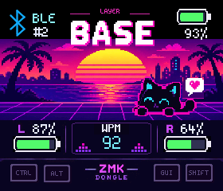
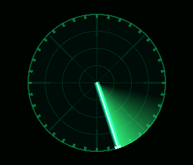

# ZDSE Themes

Optional themes for
[`zmk-dongle-screen-engine`](https://github.com/hitsmaxft/zmk-dongle-screen-engine).
Each theme is compiled only when its Kconfig option is explicitly enabled.

[Open the interactive preview gallery](https://gh.bhee.online/zdse-themes/).

## Neon Cat 1.0

A synthwave pixel HUD with a time-driven character, water shimmer, equalizer,
keyboard status, and modifier feedback.



The complete C renderer and generated atlas/font payloads are under
[`themes/neon-cat`](themes/neon-cat). Original artwork, sprite sheets, and asset
generation tools are intentionally not distributed.

## Phosphor Radar

A procedural green CRT-style radar with a bright sweep, smooth fading trail,
stationary echoes, touch-to-boost, and swipe-selectable speed.



The complete procedural theme is under [`themes/radar`](themes/radar).

## Basic ZMK demo build

Add the Engine and this repository to your ZMK `west.yml` manifest:

```yaml
manifest:
  remotes:
    - name: hitsmaxft
      url-base: https://github.com/hitsmaxft
  projects:
    - name: zmk-dongle-screen-engine
      remote: hitsmaxft
      revision: v1.1.2
      path: modules/zmk-dongle-screen-engine
    - name: zdse-themes
      remote: hitsmaxft
      revision: v1.0.0
      path: modules/zdse-themes
```

Then add the Engine host shield and your display hardware shield to a dongle
target. This minimal `build.yaml` example explicitly enables Neon Cat 1.0:

```yaml
include:
  - board: xiao_ble/nrf52840/zmk
    shield: <your-display-shield> dongle_screen_host
    cmake-args: >-
      -DCONFIG_ZDSE_NEON_CAT_THEME=y
      -DCONFIG_ZMK_DONGLE_SCREEN_DIRECT_RGB565=y
      -DCONFIG_ZMK_DONGLE_SCREEN_FPS=60
    artifact-name: zdse_neon_cat_demo
```

Use `CONFIG_ZDSE_RADAR_THEME=y` and 24 FPS for Radar. Neither theme is selected
merely by adding this repository to a West workspace.

The display shield must configure its controller, resolution, rotation,
backlight, and optional touch device. The validated reference target uses an
nRF52840, a 280×240 ST7789 RGB565 display, and a CST816S touch controller.
Build success does not by itself prove physical display timing or touch wiring.

## Writing a theme

Start with the Engine's
[`examples/minimal-theme`](https://github.com/hitsmaxft/zmk-dongle-screen-engine/tree/main/examples/minimal-theme),
then use these themes for animation timing, retained redraws, gestures, and
preview integration. Shared raster, sprite, and pixel-UI helpers belong in the
Engine; theme repositories should keep their own motion, layout, palette, and
composition.

Preview images are native/WASM RGB565 render results, not physical-display
validation.

## License

Theme source and generated Neon Cat payloads are MIT licensed. The included
Spleen bitmap subset retains its BSD-2-Clause license. Preview images are
provided for documentation and visual reference only.
